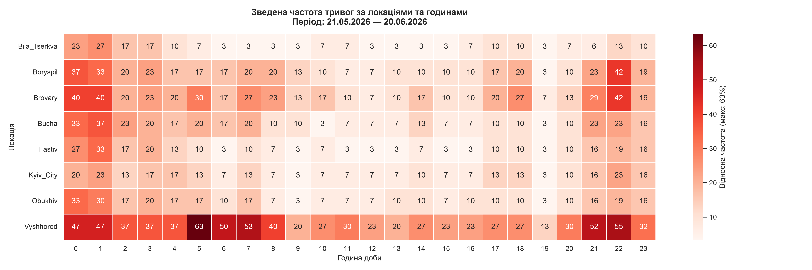
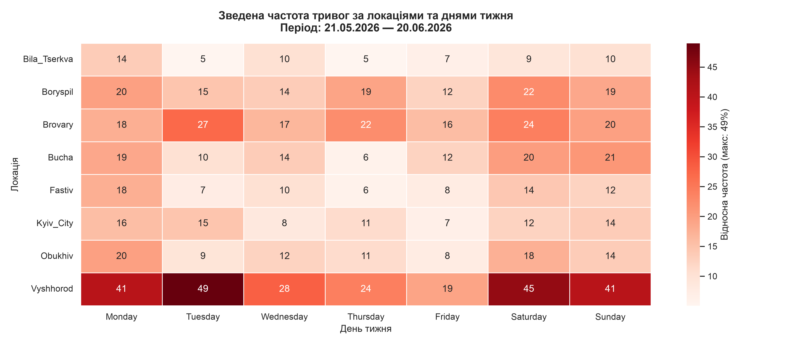

# Kyiv Air Raid Alerts — Historical Pattern Analysis

A small utility that analyses historical air raid alert patterns for Kyiv
and the surrounding raions of Kyiv Oblast, to identify the hours and days
that have historically been quietest. Intended as a planning aid for routine
civilian logistics (e.g. crossing bridges between banks of the Dnipro),
not as a forecast.

## What it does

Pulls the last 30 days of alert history from the alerts.in.ua API, converts
raw alert intervals into a continuous hourly time series, and visualises the
historical frequency of alerts by hour of day and day of week.

## Results

Consolidated alert frequency across all monitored locations, by hour of day
and by day of week:





Per-location hourly and weekday profiles are in [`plots/`](plots/).

## Important limitations

- **This is retrospective analysis, not prediction.** Air raid alerts reflect
  adversary actions, not a natural cycle. Past patterns do not guarantee future
  behaviour. The tool describes what happened, it does not forecast what will.
- **30-day window only.** The API's historical endpoint supports a single
  period (`month_ago`), so a single run cannot produce seasonal or yearly
  analysis. See "Future potential" below for how this is overcome over time.
- **Small sample.** With ~30 days of data, a full hour×weekday grid (168 cells)
  has only ~4 observations per cell — statistically meaningless. The tool
  therefore reports aggregated 1D profiles (by hour, by weekday) where each
  point rests on ~30–100 observations, and a consolidated location×hour matrix.
- **Alert ≠ impact.** An alert is a warning, not a confirmed strike. Real
  safety systems (e.g. Ukrzaliznytsia) use live airspace tracking, not alert
  statistics. This tool deliberately solves a civilian planning problem, not
  a safety-critical one.

## Setup

```bash
pip install -r requirements.txt
export ALERTS_IN_UA_TOKEN="your_token_here"
```

## Usage

```bash
python3 fetch_history.py     # downloads & caches raw alert data (respects rate limits)
python3 analyzer.py          # builds the hourly time series → processed_time_series.csv
python3 visualizer.py        # generates plots → plots/
```

Note: `fetch_history.py` skips locations already cached in `raw_data/` to
avoid hitting rate limits. To pull a fresh window, clear `raw_data/` before
running.

The pipeline is parameterised by region UID, so it can be extended to any
Ukrainian oblast by adding entries to the `LOCATIONS` map.

## Future potential

The 30-day API limit is overcome not in space, but in time. Scheduled to run
on the 1st of each month (e.g. via cron or a GitHub Action) and to archive each
window into a dated dataset, the tool accumulates 12 comparable monthly slices
per year. This opens analysis the single-run version cannot reach:

- **Year-over-year seasonality** across accumulated slices (with the caveat that
  windows are stitched end-to-end, not overlapping).
- **Trend tracking** — whether alert frequency in a region is rising or falling
  month to month, and how the daily rhythm shifts as adversary tactics change.
- **Cross-region expansion** — the same pipeline runs for any oblast by UID,
  enabling a national rhythm map rather than a single-region snapshot.

## Data source

alerts.in.ua public API. Alerts are sourced from official channels.
The `calculated` field flags estimated (vs. actual) alert end times — in the
current window all end times were actual.

## Reflection

This project was built iteratively with an AI assistant as the primary
engineering tool. The development log is included as part of the submission.

The development-stage scripts — early API exploration (`fetch_regions.py`)
and the first single-region fetcher (`fetch_history_oblast.py`) — are
preserved on the **`prototype`** branch of this repository. Check out that
branch to see the full prototyping history.
